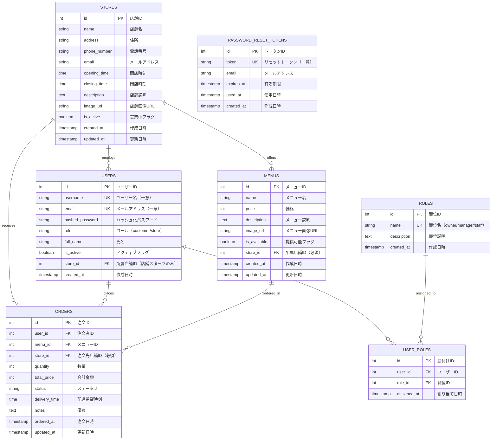

# データベーススキーマ - ER図

## 概要

本システムは**マルチテナント設計**を採用しており、複数の店舗が独立してサービスを提供できます。
`stores`テーブルを中核として、各店舗のメニュー・注文・売上データを完全に分離しています。

## ER図



## テーブル説明

### STORES (店舗テーブル) 🏪

**マルチテナントシステムの中核テーブル**

各店舗の基本情報を管理し、メニュー・注文・ユーザー（店舗スタッフ）と紐付けられます。

| カラム | 型 | 制約 | 説明 |
|--------|-----|------|------|
| id | INTEGER | PK | 店舗ID（主キー） |
| name | VARCHAR(100) | NOT NULL, INDEX | 店舗名 |
| address | VARCHAR(255) | NOT NULL | 住所 |
| phone_number | VARCHAR(20) | NOT NULL | 電話番号 |
| email | VARCHAR(255) | NOT NULL | メールアドレス |
| opening_time | TIME | NOT NULL | 開店時刻 |
| closing_time | TIME | NOT NULL | 閉店時刻 |
| description | TEXT | NULL | 店舗説明 |
| image_url | VARCHAR(500) | NULL | 店舗画像URL |
| is_active | BOOLEAN | DEFAULT TRUE | 営業中フラグ |
| created_at | TIMESTAMP | AUTO | 作成日時 |
| updated_at | TIMESTAMP | AUTO | 更新日時 |

**リレーションシップ:**
- `users`: この店舗で働くスタッフ（1:N）
- `menus`: この店舗が提供するメニュー（1:N）
- `orders`: この店舗が受けた注文（1:N）

### USERS (ユーザーテーブル) 👤

お客様と店舗スタッフの両方を管理する統合テーブル。

| カラム | 型 | 制約 | 説明 |
|--------|-----|------|------|
| id | INTEGER | PK | ユーザーID |
| username | VARCHAR(255) | UNIQUE, NOT NULL, INDEX | ユーザー名 |
| email | VARCHAR(255) | UNIQUE, NOT NULL, INDEX | メールアドレス |
| hashed_password | VARCHAR(255) | NOT NULL | ハッシュ化パスワード |
| role | VARCHAR(50) | NOT NULL | 'customer' または 'store' |
| full_name | VARCHAR(255) | NULL | 氏名 |
| is_active | BOOLEAN | DEFAULT TRUE | アクティブフラグ |
| store_id | INTEGER | FK, NULL, INDEX | 所属店舗ID（店舗スタッフのみ） |
| created_at | TIMESTAMP | AUTO | 作成日時 |

**ロール別のstore_id設定:**
- **お客様（role='customer'）**: `store_id` は NULL（全店舗のメニューを注文可能）
- **店舗スタッフ（role='store'）**: `store_id` に所属店舗IDを設定（必須）

**リレーションシップ:**
- `store`: 所属店舗（N:1）- 店舗スタッフの場合のみ
- `orders`: このユーザーが行った注文（1:N）
- `user_roles`: ユーザーに割り当てられた職位（1:N）

### ROLES (職位テーブル) 🎖️

店舗スタッフの職位を定義。権限レベルを管理。

| カラム | 型 | 制約 | 説明 |
|--------|-----|------|------|
| id | INTEGER | PK | 職位ID |
| name | VARCHAR(50) | UNIQUE, NOT NULL | 職位名 |
| description | TEXT | NULL | 職位説明 |
| created_at | TIMESTAMP | AUTO | 作成日時 |

**標準職位:**
| name | description | 権限レベル |
|------|-------------|-----------|
| owner | 店舗オーナー | 最高（全権限） |
| manager | 店舗マネージャー | 高（メニュー管理、売上閲覧） |
| staff | 店舗スタッフ | 低（注文確認のみ） |

### USER_ROLES (ユーザー職位紐付けテーブル)

ユーザーと職位のN対N関係を管理。

| カラム | 型 | 制約 | 説明 |
|--------|-----|------|------|
| id | INTEGER | PK | 紐付けID |
| user_id | INTEGER | FK, NOT NULL | ユーザーID |
| role_id | INTEGER | FK, NOT NULL | 職位ID |
| assigned_at | TIMESTAMP | AUTO | 割り当て日時 |

### MENUS (メニューテーブル) 🍱

各店舗が提供するメニュー。店舗ごとに完全分離。

| カラム | 型 | 制約 | 説明 |
|--------|-----|------|------|
| id | INTEGER | PK | メニューID |
| name | VARCHAR(255) | NOT NULL | メニュー名 |
| price | INTEGER | NOT NULL | 価格（円） |
| description | TEXT | NULL | メニュー説明 |
| image_url | VARCHAR(500) | NULL | メニュー画像URL |
| is_available | BOOLEAN | DEFAULT TRUE | 提供可能フラグ |
| store_id | INTEGER | FK, NOT NULL, INDEX | 所属店舗ID（必須）⭐ |
| created_at | TIMESTAMP | AUTO | 作成日時 |
| updated_at | TIMESTAMP | AUTO | 更新日時 |

**マルチテナント対応:**
- ⭐ `store_id` は必須項目
- 店舗スタッフは自店舗のメニューのみ作成・編集可能
- お客様は全店舗のメニューを閲覧可能

**リレーションシップ:**
- `store`: 所属店舗（N:1）
- `orders`: このメニューが注文された注文（1:N）

### ORDERS (注文テーブル) 📋

お客様の注文情報。店舗ごとに分離。

| カラム | 型 | 制約 | 説明 |
|--------|-----|------|------|
| id | INTEGER | PK | 注文ID |
| user_id | INTEGER | FK, NOT NULL | 注文者ID |
| menu_id | INTEGER | FK, NOT NULL | メニューID |
| store_id | INTEGER | FK, NOT NULL, INDEX | 注文先店舗ID（必須）⭐ |
| quantity | INTEGER | NOT NULL | 数量 |
| total_price | INTEGER | NOT NULL | 合計金額（円） |
| status | VARCHAR(50) | NOT NULL | ステータス |
| delivery_time | TIME | NULL | 配達希望時刻 |
| notes | TEXT | NULL | 備考 |
| ordered_at | TIMESTAMP | AUTO | 注文日時 |
| updated_at | TIMESTAMP | AUTO | 更新日時 |

**注文ステータス:**
| status | 説明 |
|--------|------|
| pending | 受付中 |
| confirmed | 確認済み |
| preparing | 調理中 |
| ready | 準備完了 |
| delivering | 配達中 |
| completed | 完了 |
| cancelled | キャンセル |

**マルチテナント対応:**
- ⭐ `store_id` は必須項目
- 店舗スタッフは自店舗の注文のみ閲覧・管理可能
- お客様は自分の注文のみ閲覧可能

**リレーションシップ:**
- `user`: 注文者（N:1）
- `menu`: 注文メニュー（N:1）
- `store`: 注文先店舗（N:1）

### PASSWORD_RESET_TOKENS (パスワードリセットトークンテーブル) 🔑

パスワードリセット用のトークン管理。セキュリティ機能。

| カラム | 型 | 制約 | 説明 |
|--------|-----|------|------|
| id | INTEGER | PK | トークンID |
| token | VARCHAR(255) | UNIQUE, NOT NULL | リセットトークン |
| email | VARCHAR(255) | NOT NULL | メールアドレス |
| expires_at | TIMESTAMP | NOT NULL | 有効期限 |
| used_at | TIMESTAMP | NULL | 使用日時 |
| created_at | TIMESTAMP | AUTO | 作成日時 |

**セキュリティ仕様:**
- トークンの有効期限: 1時間
- 使い捨て: `used_at` に値があるトークンは再利用不可
- レート制限: 同一メールアドレスへのリクエストは5分間に1回まで

## 外部キー制約

| 子テーブル | 外部キー | 参照先 | ON DELETE |
|-----------|---------|--------|-----------|
| users | store_id | stores.id | SET NULL |
| user_roles | user_id | users.id | CASCADE |
| user_roles | role_id | roles.id | CASCADE |
| menus | store_id | stores.id | CASCADE |
| orders | user_id | users.id | - |
| orders | menu_id | menus.id | - |
| orders | store_id | stores.id | CASCADE |

## マルチテナント対応の詳細

### データ分離の仕組み

本システムでは、**Row-Level Security（行レベルセキュリティ）**の考え方を採用し、
すべての店舗向けAPIで `store_id` による厳格なフィルタリングを実装しています。

#### 1. メニューの分離

**店舗スタッフが自店舗のメニューのみアクセス:**
```python
# ✅ 正しい実装例
menus = db.query(Menu).filter(
    Menu.store_id == current_user.store_id  # 必須フィルタ
).all()

# ❌ 危険な実装（他店舗データが漏洩）
menus = db.query(Menu).all()
```

**お客様は全店舗のメニューを閲覧:**
```python
# お客様向けAPI（store_idフィルタなし）
menus = db.query(Menu).filter(Menu.is_available == True).all()
```

#### 2. 注文の分離

**店舗スタッフが自店舗の注文のみアクセス:**
```python
# ✅ 正しい実装例
orders = db.query(Order).filter(
    Order.store_id == current_user.store_id  # 必須フィルタ
).all()

# 注文ステータス更新時もstore_idでフィルタ
order = db.query(Order).filter(
    Order.id == order_id,
    Order.store_id == current_user.store_id  # 他店舗の注文は404
).first()
```

**お客様は自分の注文のみアクセス:**
```python
# お客様向けAPI（user_idでフィルタ）
orders = db.query(Order).filter(
    Order.user_id == current_user.id
).all()
```

#### 3. 売上レポートの分離

**集計クエリもstore_idでフィルタリング:**
```python
# 日別売上集計
daily_sales = db.query(
    func.date(Order.ordered_at).label('date'),
    func.sum(Order.total_price).label('total')
).filter(
    Order.store_id == current_user.store_id,  # 必須フィルタ
    Order.status != 'cancelled'
).group_by(func.date(Order.ordered_at)).all()

# メニュー別売上集計
menu_sales = db.query(
    Menu.name,
    func.count(Order.id).label('order_count'),
    func.sum(Order.total_price).label('revenue')
).join(Order).filter(
    Order.store_id == current_user.store_id,  # 必須フィルタ
    Order.status != 'cancelled'
).group_by(Menu.name).all()
```

### セキュリティベストプラクティス

#### ✅ DO（推奨）

1. **常にstore_idでフィルタリング**
   ```python
   if not current_user.store_id:
       raise HTTPException(status_code=400, detail="User is not associated with any store")
   
   resources = db.query(Resource).filter(
       Resource.store_id == current_user.store_id
   ).all()
   ```

2. **データ作成時はサーバー側でstore_idを自動設定**
   ```python
   db_menu = Menu(
       **menu.dict(),
       store_id=current_user.store_id  # クライアントから受け取らない
   )
   ```

3. **存在しないリソースは404を返す**
   ```python
   # 他店舗のデータの場合も404で統一（403は使わない）
   resource = db.query(Resource).filter(
       Resource.id == resource_id,
       Resource.store_id == current_user.store_id
   ).first()
   if not resource:
       raise HTTPException(status_code=404, detail="Resource not found")
   ```

4. **エラーメッセージに機密情報を含めない**
   ```python
   # ✅ 良い例
   raise HTTPException(status_code=404, detail="Menu not found")
   
   # ❌ 悪い例（他店舗のデータの存在が判明）
   raise HTTPException(status_code=403, detail="You cannot access Menu ID 123 (owned by Store B)")
   ```

#### ❌ DON'T（非推奨）

1. **store_idをクライアントから受け取る**
   ```python
   # ❌ 危険（クライアントが他店舗のstore_idを指定可能）
   db_menu = Menu(**menu.dict())  # menu.store_id をそのまま使用
   ```

2. **集計クエリでstore_idフィルタを忘れる**
   ```python
   # ❌ 危険（全店舗の売上が混在）
   total_sales = db.query(func.sum(Order.total_price)).scalar()
   ```

3. **JOIN時にフィルタを忘れる**
   ```python
   # ❌ 危険
   menus = db.query(Menu).join(Order).all()
   
   # ✅ 正しい
   menus = db.query(Menu).join(Order).filter(
       Menu.store_id == current_user.store_id
   ).all()
   ```

### テスト方法

マルチテナントデータ分離の検証は `tests/test_store_isolation.py` で実施しています。

```bash
# データ分離テストを実行
docker-compose exec web pytest tests/test_store_isolation.py -v

# 検証内容（全13テスト）:
# ✅ 店舗Aが店舗Bの注文にアクセスできないこと
# ✅ 店舗Aが店舗Bのメニューを編集・削除できないこと
# ✅ 注文一覧に他店舗の注文が含まれないこと
# ✅ メニュー一覧に他店舗のメニューが含まれないこと
# ✅ ダッシュボードに他店舗の売上が混在しないこと
# ✅ 売上レポートに他店舗のデータが含まれないこと
# ✅ すべての職位で同様にデータ分離が機能すること
# ✅ エラーメッセージから情報が漏洩しないこと
```

詳細なテスト結果は以下のドキュメントを参照:
- [セキュリティテストレポート](SECURITY_TEST_REPORT_MULTI_TENANT.md)
- [セキュリティ修正完了レポート](SECURITY_FIX_COMPLETE_REPORT.md)

## マルチテナント対応

### データフロー図

```
┌─────────────┐
│ お客様      │ ← store_id = NULL（全店舗のメニューを閲覧可能）
└──────┬──────┘
       │
       │ 注文作成
       ▼
┌──────────────────────────────────────────┐
│              ORDERS テーブル              │
│  各注文は store_id で店舗に紐付けられる   │
└──────┬───────────────────┬───────────────┘
       │                   │
       │ store_id=1        │ store_id=2
       ▼                   ▼
┌─────────────┐      ┌─────────────┐
│ 店舗A       │      │ 店舗B       │
│ スタッフ    │      │ スタッフ    │
└─────────────┘      └─────────────┘
   ↓                      ↓
自店舗データのみ      自店舗データのみ
  アクセス可能          アクセス可能
```

### インデックス戦略

**パフォーマンス最適化のため、store_idにインデックスを作成:**

```sql
-- users テーブル
CREATE INDEX idx_users_store_id ON users(store_id);

-- menus テーブル
CREATE INDEX idx_menus_store_id ON menus(store_id);

-- orders テーブル
CREATE INDEX idx_orders_store_id ON orders(store_id);

-- 複合インデックス（よく使われるクエリパターン）
CREATE INDEX idx_orders_store_status ON orders(store_id, status);
CREATE INDEX idx_menus_store_available ON menus(store_id, is_available);
```

**推奨クエリパターン:**
```python
# インデックスを活用した高速クエリ
orders = db.query(Order).filter(
    Order.store_id == 1,  # インデックス使用
    Order.status == 'pending'  # 複合インデックス使用
).all()
```

## 拡張性と将来の展望

### スケーラビリティ

- **垂直スケーリング**: PostgreSQLの性能向上
- **水平スケーリング**: 店舗数増加に対応（店舗IDによるシャーディング可能）
- **キャッシング**: Redisを導入してメニュー情報をキャッシュ可能

### 将来の機能拡張

- **マルチブランド対応**: 店舗をブランドでグループ化
- **フランチャイズ管理**: 本部と加盟店の階層構造
- **店舗間データ共有**: オプトインでメニューテンプレートを共有
- **API Key管理**: 外部システム連携用のAPI Key発行

## 参考資料

- **マルチテナント設計パターン**: [docs/MULTI_TENANT_ARCHITECTURE.md](MULTI_TENANT_ARCHITECTURE.md)（計画中）
- **セキュリティベストプラクティス**: [docs/SECURITY_FIX_COMPLETE_REPORT.md](SECURITY_FIX_COMPLETE_REPORT.md)
- **API実装ガイド**: [README.md](../README.md) - 開発ワークフロー
