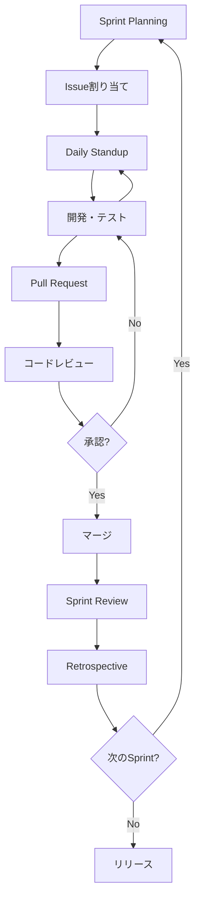

# Milestone 7: データ可視化画面実装 - Issue 提案書

**作成日:** 2024-12-15  
**対象:** 5 人チーム開発（PO、SM、Frontend、Backend API、Backend DB）  
**目的:** チーム開発学習を最優先とした段階的な実装計画

---

## 📋 現状の確認

### ✅ 実装済み機能（Issue #111 対応完了）

- Owner 用の全店舗データアクセス API
  - `GET /api/store/dashboard` - ダッシュボードサマリー
  - `GET /api/store/dashboard/weekly-sales` - 週次売上
  - `GET /api/store/reports/sales` - 売上レポート
- Owner/Manager/Staff 権限別テスト（9 テスト全合格）

### 🎯 Milestone 7 のゴール

店舗の意思決定をデータで支援する高度な可視化画面を実装し、Owner は全店舗の横断分析、Manager は担当店舗の深掘り分析を可能にする。

---

## 👥 チーム構成と役割

| 役割                       | 担当者  | 主な責務                                         |
| -------------------------- | ------- | ------------------------------------------------ |
| **Product Owner**          | PO さん | 要件定義、優先順位付け、ビジネス価値の伝達       |
| **Scrum Master**           | SM さん | プロセス管理、障害除去、チームファシリテーション |
| **Frontend Engineer**      | A さん  | UI/UX 実装、コンポーネント設計、E2E テスト       |
| **Backend Engineer (API)** | C さん  | API 設計・実装、ビジネスロジック、統合テスト     |
| **Backend Engineer (DB)**  | B さん  | データ設計、最適化、テストデータ生成             |

---

## 🗓️ スプリント計画（3 スプリント構成）

### Sprint 1: テーブル表示による売上レポート（2-3 週間）

**学習目標:** API 連携、権限制御、基本的なデータ表示

### Sprint 2: 基本的なグラフ表示（2-3 週間）

**学習目標:** Chart.js 統合、データビジュアライゼーション

### Sprint 3: 高度な可視化とダッシュボード（2-3 週間）

**学習目標:** 複合グラフ、パフォーマンス最適化、統合

---

## 📊 Issue 一覧（全 21 Issues）

### 🏃 Sprint 1: 売上レポート画面（テーブル表示）

| #        | タイトル                      | 担当   | SP  | 依存      | 概要                                     |
| -------- | ----------------------------- | ------ | --- | --------- | ---------------------------------------- |
| **#112** | 要件定義とモックアップ作成    | PO/SM  | 2   | -         | ワイヤーフレーム、ユーザーストーリー作成 |
| **#113** | 売上レポート API 仕様確認     | C      | 1   | #112      | 既存 API 仕様のドキュメント化            |
| **#114** | テストデータ生成スクリプト    | B      | 2   | #112      | 複数店舗 30 日分のリアルなデータ生成     |
| **#115** | コンポーネント設計            | A      | 2   | #112,#113 | 画面構成とコンポーネント設計             |
| **#116** | 共通 Table コンポーネント実装 | A      | 3   | #115      | ソート・ページネーション対応             |
| **#117** | API エラーハンドリング強化    | C      | 2   | #113      | バリデーション、レート制限実装           |
| **#118** | Manager 版画面実装            | A      | 5   | #113,#116 | 自店舗データ表示画面                     |
| **#119** | Owner 版画面実装              | A      | 3   | #118      | 全店舗比較表示画面                       |
| **#120** | Sprint 1 統合テスト           | SM/All | 2   | #118,#119 | QA、動作確認、バグ修正                   |

**Sprint 1 合計:** 22 Story Points

---

### 📈 Sprint 2: グラフ表示（基本的な可視化）

| #        | タイトル                 | 担当   | SP  | 依存      | 概要                                     |
| -------- | ------------------------ | ------ | --- | --------- | ---------------------------------------- |
| **#121** | グラフ要件定義           | PO/SM  | 2   | #120      | グラフ種類、カラー、インタラクション定義 |
| **#122** | Chart.js 統合            | A      | 3   | #121      | ライブラリ導入、共通コンポーネント       |
| **#123** | グラフ用データ集約 API   | C      | 3   | #121      | 日別・メニュー別・時間帯別 API 実装      |
| **#124** | 日別売上グラフ実装       | A      | 3   | #122,#123 | 折れ線グラフ、期間連動                   |
| **#125** | メニュー別売上グラフ実装 | A      | 3   | #122,#123 | 棒グラフ、トップ 10 表示                 |
| **#126** | Sprint 2 統合テスト      | SM/All | 2   | #124,#125 | グラフ精度検証、性能テスト               |

**Sprint 2 合計:** 16 Story Points

---

### 🚀 Sprint 3: 高度な可視化（複合グラフ・ダッシュボード）

| #        | タイトル                   | 担当  | SP  | 依存 | 概要                             |
| -------- | -------------------------- | ----- | --- | ---- | -------------------------------- |
| **#127** | 高度な可視化要件定義       | PO/SM | 3   | #126 | ダッシュボード、複合グラフ要件   |
| **#128** | マテリアライズドビュー作成 | B     | 3   | #127 | 集計クエリ最適化、インデックス   |
| **#129** | 高度な分析 API 実装        | C     | 5   | #128 | 予測、比較、異常検知 API         |
| **#130** | 複合グラフコンポーネント   | A     | 5   | #129 | 複数軸、積み上げ、ヒートマップ   |
| **#131** | データエクスポート機能     | A     | 3   | #130 | CSV/PDF/画像エクスポート         |
| **#132** | 最終統合テストとリリース   | All   | 5   | #131 | 全機能統合、負荷テスト、リリース |

**Sprint 3 合計:** 24 Story Points

---

## 📈 全体サマリー

- **総 Issue 数:** 21
- **総 Story Points:** 62
- **推定期間:** 6-9 週間（1 スプリント=2-3 週間）
- **チームベロシティ想定:** 20-25 SP/Sprint

---

## 🎓 学習ポイント

### 1️⃣ Sprint 1 で学ぶこと

- 📋 **PO/SM:** 要件定義、モックアップ、スクラム運営
- 💾 **Backend DB:** テストデータ設計、SQL の実践
- 🔌 **Backend API:** 既存 API 理解、エラーハンドリング
- 🎨 **Frontend:** コンポーネント設計、API 連携、権限制御

### 2️⃣ Sprint 2 で学ぶこと

- 📊 **Frontend:** Chart.js、データビジュアライゼーション
- 🔌 **Backend API:** グラフ用データ集約、JSON 最適化
- 🤝 **全員:** API-Frontend 連携、依存関係管理

### 3️⃣ Sprint 3 で学ぶこと

- 💾 **Backend DB:** パフォーマンス最適化、マテリアライズドビュー
- 🔌 **Backend API:** 高度な分析、キャッシング、スケーラビリティ
- 🎨 **Frontend:** 複雑な UI コンポーネント、エクスポート機能
- 🤝 **全員:** 統合テスト、負荷テスト、リリースプロセス

---

## 🔄 開発フロー



---

## 📝 各 Issue 共通テンプレート

### Issue 作成時に含めるべき項目

```markdown
## 概要

[この Issue で何を実現するか]

## 受け入れ基準

- [ ] 基準 1
- [ ] 基準 2
- [ ] 基準 3

## 成果物

- ファイル名やドキュメント

## 学習ポイント

- この Issue で学べること

## 技術ヒント

- 参考リンクやコード例

## 依存関係

- 前提となる Issue: #xxx
- ブロックされる Issue: #yyy

## 見積もり

- Story Points: X
- 工数見積: X 日

## 備考

- その他注意事項
```

---

## 🚦 Definition of Done（完了の定義）

各 Issue は以下を満たすことで完了とする:

### コード品質

- [ ] コーディング規約に準拠
- [ ] Lint エラーなし
- [ ] 型チェック合格（TypeScript/Python）

### テスト

- [ ] ユニットテスト実装（カバレッジ 80%以上）
- [ ] 統合テスト実装（該当する場合）
- [ ] 手動テスト完了

### ドキュメント

- [ ] コード内コメント適切
- [ ] README 更新（必要な場合）
- [ ] API 仕様書更新（API 変更時）

### レビュー

- [ ] Pull Request 作成
- [ ] 最低 1 名のレビュー承認
- [ ] CI/CD パイプライン合格

### デモ

- [ ] Sprint Review でデモ可能な状態

---

## 🎯 成功の指標（KPI）

### 開発プロセス

- ✅ スプリント完了率: 90%以上
- ✅ バグ発見率: Sprint 内で 95%以上解決
- ✅ コードレビュー時間: 24 時間以内

### 品質

- ✅ テストカバレッジ: 80%以上
- ✅ API 応答時間: 95%が 500ms 以内
- ✅ フロントエンド性能: Lighthouse 90 点以上

### チーム学習

- ✅ 全メンバーが全 Sprint で最低 1 Issue 担当
- ✅ ペアプログラミング: 週 2 回以上実施
- ✅ レトロスペクティブ: 毎 Sprint 実施

---

## 📅 推奨スケジュール例

### Sprint 1（Week 1-3）

- **Week 1:** #112-#115（要件定義・設計）
- **Week 2:** #116-#119（実装）
- **Week 3:** #120（テスト・バグ修正）

### Sprint 2（Week 4-6）

- **Week 4:** #121-#123（要件・基盤実装）
- **Week 5:** #124-#125（グラフ実装）
- **Week 6:** #126（テスト）

### Sprint 3（Week 7-9）

- **Week 7:** #127-#129（要件・DB 最適化・API）
- **Week 8:** #130-#131（高度な可視化）
- **Week 9:** #132（統合テスト・リリース）

---

## 🛠️ 推奨ツール

### プロジェクト管理

- **GitHub Projects** - カンバンボード
- **GitHub Issues** - タスク管理
- **GitHub Milestones** - Sprint 管理

### コミュニケーション

- **Slack/Discord** - デイリーコミュニケーション
- **Zoom/Google Meet** - デイリースタンドアップ、レビュー

### 設計・ドキュメント

- **Figma** - モックアップ作成
- **Mermaid** - 図表作成
- **Markdown** - ドキュメント作成

### 開発

- **VS Code** - エディタ
- **Postman/Thunder Client** - API テスト
- **Storybook** - コンポーネント開発
- **Playwright/Cypress** - E2E テスト

---

## 🚀 次のアクション

### 1. キックオフミーティング（1-2 時間）

- [ ] Milestone 7 の全体像共有
- [ ] Issue 一覧の確認と質疑応答
- [ ] Sprint 1 の詳細計画
- [ ] 各自の学習目標設定

### 2. Sprint 1 開始準備

- [ ] PO さん・SM さん: Issue #112 作成・着手
- [ ] 全員: 開発環境セットアップ確認
- [ ] 全員: GitHub リポジトリアクセス確認

### 3. デイリープラクティス

- [ ] 毎朝 10 分のスタンドアップ
- [ ] Slack での進捗共有
- [ ] ブロッカーの即座のエスカレーション

### 4. スプリント終了時

- [ ] Sprint Review（デモ）
- [ ] Retrospective（振り返り）
- [ ] 次 Sprint のプランニング

---

## 📚 参考ドキュメント

- [Owner データアクセス修正完了レポート](./OWNER_DATA_ACCESS_BUG_FIX_COMPLETE.md)
- [Milestone 7 評価レポート](./MILESTONE_7_CRITICAL_EVALUATION.md)
- [マルチテナントガイド](./MULTI_TENANT_GUIDE.md)
- [既存 API 仕様](../routers/store.py)
- [既存テスト](../tests/test_owner_data_access.py)

---

## ✍️ 更新履歴

| 日付       | バージョン | 変更内容 | 作成者         |
| ---------- | ---------- | -------- | -------------- |
| 2024-12-15 | 1.0        | 初版作成 | GitHub Copilot |

---

## 💡 Tips

### 新人エンジニアへのアドバイス

1. **わからないことは即座に質問する**

   - 30 分悩んだら質問
   - 質問することは成長の証

2. **小さく始める**

   - 最初から完璧を目指さない
   - 動くものを作ってから改善

3. **ペアプログラミングを活用**

   - 先輩と一緒に画面共有しながらコーディング
   - 考え方を学ぶ絶好の機会

4. **テストを書く習慣**

   - 実装前にテストケースを考える
   - 自信を持ってリファクタリングできる

5. **毎日の振り返り**
   - 今日学んだことを 1 つメモ
   - 積み重ねが成長につながる

---

**Let's build something amazing together! 🎉**
